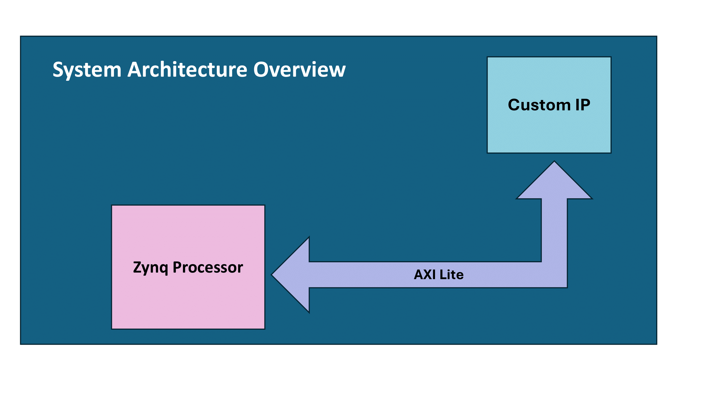
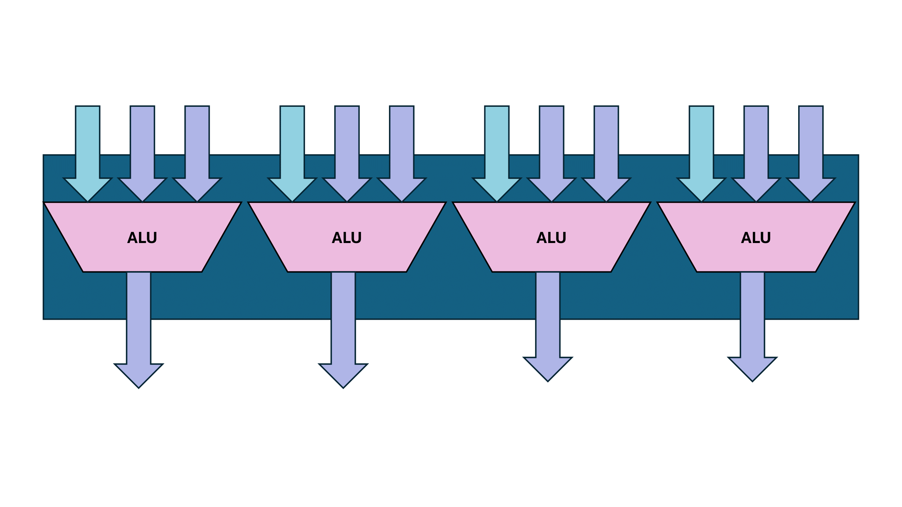

# Vector Operations

This project presents a custom IP designed to execute vector operations, comparing its performance against software-based implementations using a Zynq processor. Inspired by the RISC-V vector extension architecture, the custom IP takes advantage of FPGA capabilities to enhance computational efficiency. The evaluation indicates that while the software implementation, written in C and executed on the Zynq processor, performs faster for small-scale vector data due to lower overhead and simpler execution flow, the custom IP demonstrates superior performance as the scale of data increases. This performance gain is primarily due to the efficient handling of larger datasets through the parallel processing capabilities of the FPGA-based custom IP.

## Software Implementation

The software component comprises the `vector_ops` function written in C, which performs the designated mathematical operations on input vectors.

## Custom IP Implementation

The custom IP, named FU, includes 4 Arithmetic Logic Units (ALUs) capable of performing addition, multiplication, subtraction, and logical OR operations. These ALUs operate simultaneously and receive a shared OP signal to execute specific operations on matrices A and B. Additionally, AXI VHDL codes are generated to connect FU to the Zynq processor, enabling communication via registers. This setup facilitates efficient data transfer between the software and FU.

## Architecture of Custom IP (FU)

# Tools and Workflow

## Vivado
The custom IP was designed and implemented for a Zynq-based FPGA platform using Vivado.

## Vitis
The `vector_ops` function was developed in C to perform the mathematical operations. The environment was configured to compile and execute this function.

## Integration Steps

1. Vivado was used to integrate the custom IP into the FPGA design and produce the bitstream.
2. The bitstream generated by Vivado was imported into Vitis, integrating the FPGA design with the software environment and facilitating communication between the software and the custom IP.
3. AXI Lite registers were employed for data transfer and control signals between the software and the custom IP, enabling configuration and interaction with the custom IP from the software.

## Performance Evaluation
The execution times for the operations in both the software and custom IP implementations were measured using **XScuTimer**. These results allowed for an evaluation of the performance improvements provided by the custom IP.

## Potential Enhancements  

1.  **Use Ready and Valid Signals**: The **ready** and **valid** signals facilitate a handshake protocol between the custom IP and the Zynq processor, ensuring synchronized data transfer. The **valid** signal from the custom IP indicates that data is ready to be sent, while the **ready** signal from the Zynq processor signifies that it is prepared to receive the data. The handshake occurs when the custom IP waits for the Zynq processor to assert the **ready** signal before sending new data. This coordination ensures that data is transferred only when both the producer and consumer are in the appropriate state, thereby preventing data loss and optimizing the flow of information between the two components.

2.  **Adapt Matrices with Different Vector Sizes**: Adapting the custom IP to support matrices with varying vector sizes can make the architecture more applicable to a wider range of applications. This adaptation would enable the system to optimize performance for diverse computational tasks.

## References

1. [Resource-efficient RISC-V Vector Extension Architecture for FPGA-based Accelerators](https://dl.acm.org/doi/abs/10.1145/3597031.3597047)

2. [Designing a Custom AXI IP on Vitis](https://www.hackster.io/pablotrujillojuan/designing-a-custom-axi-ip-on-vitis-a0ad06)

